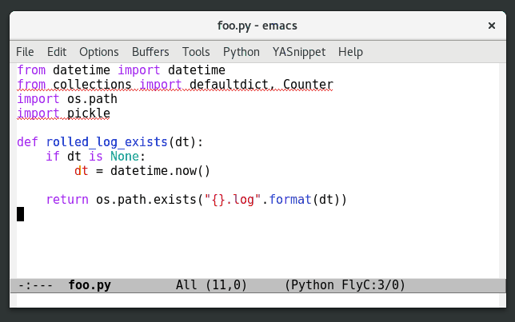
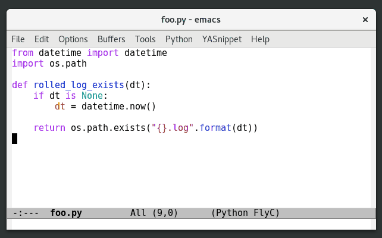

# pyimport

*Manage Python imports from Emacs!*

[](https://travis-ci.org/Wilfred/pyimport)
[](https://coveralls.io/github/Wilfred/pyimport?branch=master)
[](http://melpa.org/#/pyimport)

Installation: install from MELPA, or add pyimport.el to your
`load-path`.

## Unused Imports

Requires pyflakes to be installed.



Run `M-x pyimport-remove-unused`.

This requires `pyflakes` to be on `PATH`. Alternatively, set
`pyimport-pyflakes-path`.

## Insert Missing Imports



Place point on the missing variable, then run
`M-x pyimport-insert-missing`.

This assumes that you have another Python buffer that contains an
example of importing the variable.

I like to bind this to a key:

```emacs-lisp
(define-key python-mode-map (kbd "C-c C-i") #'pyimport-insert-missing)
```

